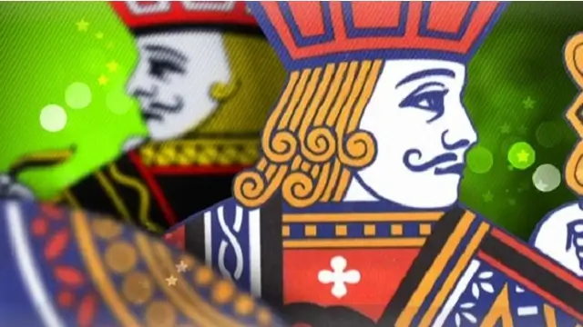

  

<h1 align="center">
  Cards Redux
</h1>
<h2>By: Michael Saucedo</h2>
 

This React project was made with Redux Toolkit and React Router. I used two of my previous games and made them work together in a single webpage. You can also install this on a mobile device as an app. Thank you and I hope you like it. [Visit Site](https://cardsredux.netlify.app/)

## 🧐 What's inside?

A quick look at the pages you'll see in this React with Tailwind project. All playing cards are from an API website. The cards are shuffled and delt with each new game or hand. More card games to be added in the future.

1.  **`/blackjack`**: Blackjack
    &emsp;
Play blackjack as both the dealer and player. Dealer must hit on 17 or less. Aces are automatically calculated for you.

2.  **`/video-poker`**: Video Poker
    &emsp;
This is my version of the casino tye of video poker machine. Just press or click on a card to hold and unhold it. Then use the draw and deal buttons

